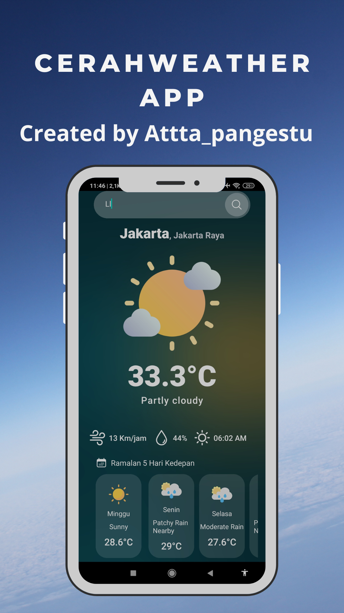

Untuk memperkecil gambar dalam dokumentasi `README.md`, Anda dapat menggunakan sintaks HTML untuk mengatur ukuran gambar. Berikut adalah contoh `README.md` yang diperbarui dengan gambar pratinjau yang lebih kecil:

### README.md

---

#### English

# CerahWeather Mobile App

CerahWeather is a mobile application that provides weather forecasts and real-time weather updates for various locations. The app uses the WeatherAPI.com to fetch weather data and displays it in a user-friendly interface.

## Features

- Real-time weather updates
- 7-day weather forecast
- Detailed weather information including temperature, humidity, wind speed, and more
- Display of weather conditions with appropriate icons
- Sunrise and sunset times
- Weather alerts

## Preview



## Installation

1. Clone the repository:

   ```bash
   git clone https://github.com/Attta-pangestu/CerahWeather-mobile-app.git
   cd CerahWeather-mobile-app
   ```

2. Install the dependencies:

   ```bash
   npm install
   ```

3. Run the app:
   ```bash
   npm start
   ```

## Usage

- Open the app and allow location permissions to get local weather updates.
- Browse through different tabs to view current weather, forecast, and detailed weather information.
- Use the search feature to find weather information for different locations.

## Contributing

Contributions are welcome! Please fork this repository and submit a pull request for any feature requests, bug fixes, or improvements.

## License

This project is licensed under the MIT License.

---

#### Bahasa Indonesia

# CerahWeather Aplikasi Mobile

CerahWeather adalah aplikasi mobile yang menyediakan prakiraan cuaca dan pembaruan cuaca waktu nyata untuk berbagai lokasi. Aplikasi ini menggunakan WeatherAPI.com untuk mengambil data cuaca dan menampilkannya dalam antarmuka yang ramah pengguna.

## Fitur

- Pembaruan cuaca waktu nyata
- Prakiraan cuaca 7 hari
- Informasi cuaca terperinci termasuk suhu, kelembaban, kecepatan angin, dan lainnya
- Menampilkan kondisi cuaca dengan ikon yang sesuai
- Waktu matahari terbit dan terbenam
- Peringatan cuaca

## Pratinjau


## Instalasi

1. Clone repository ini:

   ```bash
   git clone https://github.com/Attta-pangestu/CerahWeather-mobile-app.git
   cd CerahWeather-mobile-app
   ```

2. Install dependencies:

   ```bash
   npm install
   ```

3. Jalankan aplikasi:
   ```bash
   npm start
   ```

## Penggunaan

- Buka aplikasi dan izinkan izin lokasi untuk mendapatkan pembaruan cuaca lokal.
- Jelajahi berbagai tab untuk melihat cuaca saat ini, prakiraan, dan informasi cuaca terperinci.
- Gunakan fitur pencarian untuk menemukan informasi cuaca untuk lokasi yang berbeda.

## Berkontribusi

Kontribusi sangat diterima! Silakan fork repository ini dan kirim pull request untuk permintaan fitur, perbaikan bug, atau peningkatan.

## Lisensi

Proyek ini dilisensikan di bawah Lisensi MIT.

---

Dengan menggunakan sintaks HTML `` dan atribut `width`, Anda dapat mengatur ukuran gambar agar sesuai dengan keinginan Anda dalam dokumentasi `README.md`.
